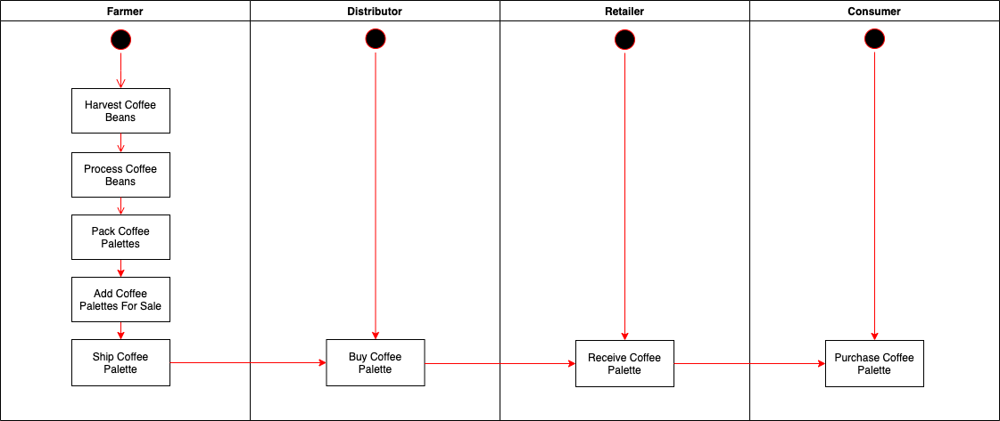
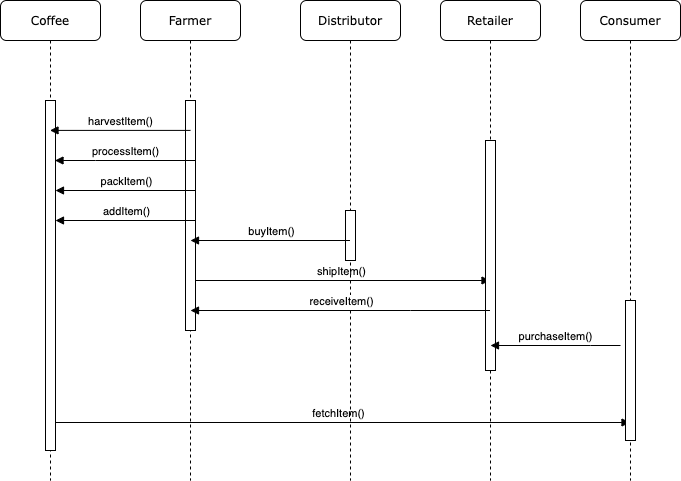
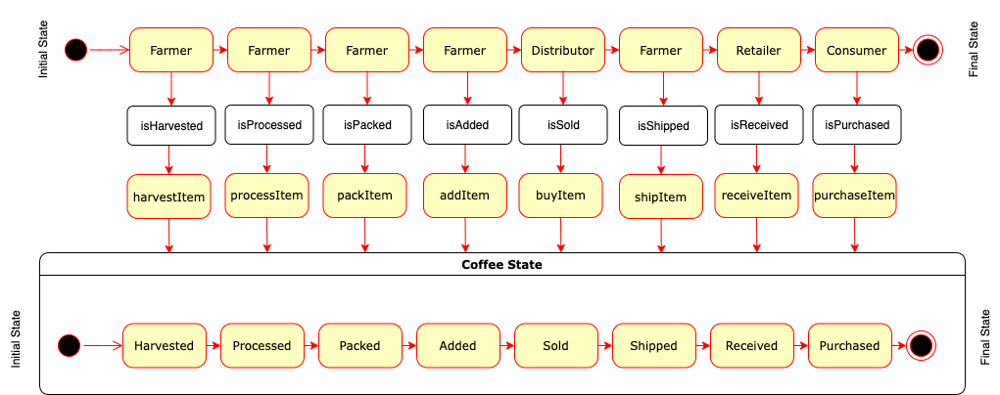
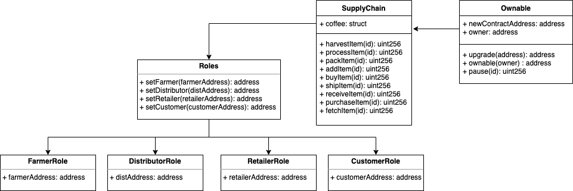

# Supply Chain Project

## Project Write-up

### UML

#### Activity Diagram

#### Sequence Diagram

#### State Diagram

#### Class Diagram

### Libraries

- truffle-hdwallet-provider - Used for providing with a Web3 provider in Truffle
- fs - used for file read/write operations
- web3 - web3 provider to connect to the blockchain

### IPFS

IPFS wasn't used for this project.

### General writeup

Steps followed to accomplish this project were

- Work on the UML diagrams
- Complete the smart contracts using the above plan
- Test the contracts
- Migrate the contracts to rinkeby Test net
- Create a frontend to interact with the deployed contracts

- Contract address - 0xce2501faCA1B5B500E5883E624dB9c34267682Eb (https://rinkeby.etherscan.io/address/0xce2501faca1b5b500e5883e624db9c34267682eb)
- Txn ID - 0x9ff220093feeda063e153d63894dbff7ad146cc606d474c5bc802a2069eada69 (https://rinkeby.etherscan.io/tx/0x9ff220093feeda063e153d63894dbff7ad146cc606d474c5bc802a2069eada69)
- Node version - v14.17.5
- Truffle version - v4.1.14
- Solidity version - v0.4.24
- Web3 version - 1.6.0
